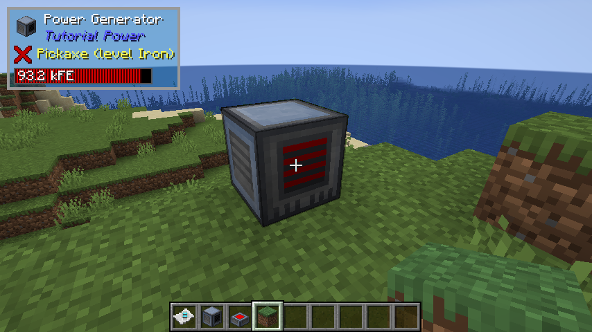
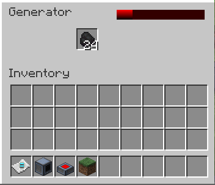
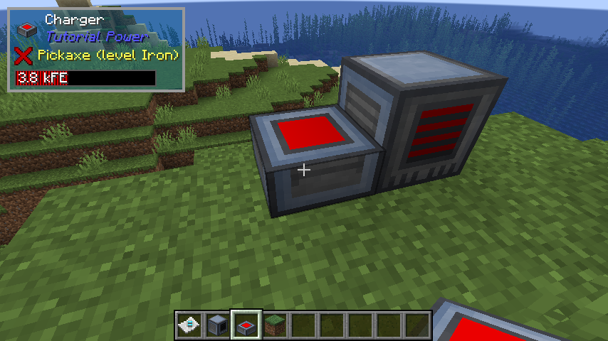

# Episode 4

## Links

<!-- * [Video](todo) -->
* Video (todo)
* [Back to 1.20 Tutorial Index](./1.20.md)
* [Tutorial GitHub](https://github.com/McJty/Tut4_3Power)
* Tag for this episode (todo)
<!-- * [Tag for this episode](todo) -->

## Introduction

In this tutorial we start with a fresh new mod. So nothing from the previous tutorials is needed.
The basic idea in this tutorial is that we are going to make a full working tech mod with power
generation, power transmition, and little bots (entities) that can do things for us if they
are charged up. This first episode only focuses on the power generation and the first block
that uses that power.

* Forge Power
* Animated texture
* Custom creative tab

Some code you'll find on the github is not explained here and some of it is not used yet.
It's there for future episodes.

## The Power Generator

The power generator is a block that will generate Forge Energy (FE) given some fuel (a
burnable item). The block will have a GUI that shows the current energy level and it also
has an item slot where you can put in fuel. The front of the generator will show when it's
generating power.

### Block

Let's start with the block. This is very similar to the block we made in the previous tutorial.
The main difference is that we support two properties (FACING and POWERED). The FACING property
is set when the player places the block based on where the player is looking.



```java
public class GeneratorBlock extends Block implements EntityBlock {

    public static final String SCREEN_TUTORIAL_GENERATOR = "tutorial.screen.generator";

    public GeneratorBlock() {
        super(BlockBehaviour.Properties.of()
                .strength(3.5F)
                .requiresCorrectToolForDrops()
                .sound(SoundType.METAL));
    }

    @Nullable
    @Override
    public BlockEntity newBlockEntity(BlockPos blockPos, BlockState blockState) {
        return new GeneratorBlockEntity(blockPos, blockState);
    }

    @Nullable
    @Override
    public <T extends BlockEntity> BlockEntityTicker<T> getTicker(Level level, BlockState state, BlockEntityType<T> type) {
        if (level.isClientSide) {
            return null;
        } else {
            return (lvl, pos, st, be) -> {
                if (be instanceof GeneratorBlockEntity generator) {
                    generator.tickServer();
                }
            };
        }
    }

    @Override
    public InteractionResult use(BlockState state, Level level, BlockPos pos, Player player, InteractionHand hand, BlockHitResult trace) {
        if (!level.isClientSide) {
            BlockEntity be = level.getBlockEntity(pos);
            if (be instanceof GeneratorBlockEntity) {
                MenuProvider containerProvider = new MenuProvider() {
                    @Override
                    public Component getDisplayName() {
                        return Component.translatable(SCREEN_TUTORIAL_GENERATOR);
                    }

                    @Override
                    public AbstractContainerMenu createMenu(int windowId, Inventory playerInventory, Player playerEntity) {
                        return new GeneratorContainer(windowId, playerEntity, pos);
                    }
                };
                NetworkHooks.openScreen((ServerPlayer) player, containerProvider, be.getBlockPos());
            } else {
                throw new IllegalStateException("Our named container provider is missing!");
            }
        }
        return InteractionResult.SUCCESS;
    }

    @Nullable
    @Override
    public BlockState getStateForPlacement(BlockPlaceContext context) {
        return this.defaultBlockState()
                .setValue(BlockStateProperties.FACING, context.getNearestLookingDirection().getOpposite())
                .setValue(BlockStateProperties.POWERED, false);
    }

    @Override
    protected void createBlockStateDefinition(StateDefinition.Builder<Block, BlockState> builder) {
        super.createBlockStateDefinition(builder);
        builder.add(BlockStateProperties.POWERED, BlockStateProperties.FACING);
    }
}
```

### BlockEntity

The block entity takes care of actually generating power when it has fuel.

Forge comes with an energy system that is capabilitiy based. Any block that supports the
IEnergyStorage capability can be used to store energy.

The generator also has an item handler capability to store items. In this case we only
support one slot for fuel.

We use an `AdaptedEnergyStorage` for the capability so that we can restrict the extraction or
insertion while still allowing internal code to modify the energy level without restrictions.
In this case our energy capability doesn't allow insertion or extraction. The reason for that
is that Forge Energy is a push system:

:::danger Warning!
Forge Energy is a push system. That means that the energy source (generator, powercell, ...)
is responsible for pushing energy to the consumer (cable, machine, ...). Cables or
machines cannot pull energy from the source! For that reason you should almost never extract
energy manually from another device!
:::

The `tickServer` method is called every tick on the server. It does two things:
 * Generate energy
 * Distribute energy to adjacent blocks

The `generateEnergy` method generates energy based on the current fuel. If there is no fuel then it
doesn't generate anything. If there is fuel then it generates energy based on the
`GENERATE` value. This value is 50 in our case. That means that every tick we generate 50
energy. The `generateEnergy` method also takes care of updating the `POWERED` property
of the block. If we are generating energy then the block is powered. If we are not
generating energy then the block is not powered.

The `distributeEnergy` method distributes energy to adjacent blocks. It does this by
looking for blocks that support the `IEnergyReceiver` capability. If it finds such a block
then it tries to push energy to it. If the block accepts the energy then we remove that
energy from our own storage.

```java
public class GeneratorBlockEntity extends BlockEntity {

    public static final String ITEMS_TAG = "Inventory";
    public static final String ENERGY_TAG = "Energy";

    public static final int GENERATE = 50;
    public static final int MAXTRANSFER = 1000;
    public static final int CAPACITY = 100000;

    public static int SLOT_COUNT = 1;
    public static int SLOT = 0;

    private final ItemStackHandler items = createItemHandler();
    private final LazyOptional<IItemHandler> itemHandler = LazyOptional.of(() -> items);

    private final EnergyStorage energy = createEnergyStorage();
    private final LazyOptional<IEnergyStorage> energyHandler = LazyOptional.of(() -> new AdaptedEnergyStorage(energy) {
        @Override
        public int receiveEnergy(int maxReceive, boolean simulate) {
            return 0;
        }

        @Override
        public int extractEnergy(int maxExtract, boolean simulate) {
            return 0;
        }

        @Override
        public boolean canExtract() {
            return false;
        }

        @Override
        public boolean canReceive() {
            return false;
        }
    });

    private int burnTime;

    public GeneratorBlockEntity(BlockPos pos, BlockState state) {
        super(Registration.GENERATOR_BLOCK_ENTITY.get(), pos, state);
    }

    public void tickServer() {
        generateEnergy();
        distributeEnergy();
    }

    // Check if we have a burnable item in the inventory and if so generate energy
    private void generateEnergy() {
        if (energy.getEnergyStored() < energy.getMaxEnergyStored()) {
            if (burnTime <= 0) {
                ItemStack fuel = items.getStackInSlot(SLOT);
                if (fuel.isEmpty()) {
                    // No fuel
                    return;
                }
                setBurnTime(ForgeHooks.getBurnTime(fuel, RecipeType.SMELTING));
                if (burnTime <= 0) {
                    // Not a fuel
                    return;
                }
                items.extractItem(SLOT, 1, false);
            } else {
                setBurnTime(burnTime-1);
                energy.receiveEnergy(GENERATE, false);
            }
            setChanged();
        }
    }

    private void setBurnTime(int bt) {
        if (bt == burnTime) {
            return;
        }
        burnTime = bt;
        if (getBlockState().getValue(BlockStateProperties.POWERED) != burnTime > 0) {
            level.setBlockAndUpdate(getBlockPos(), getBlockState().setValue(BlockStateProperties.POWERED, burnTime > 0));
        }
        setChanged();
    }

    private void distributeEnergy() {
        // Check all sides of the block and send energy if that block supports the energy capability
        for (Direction direction : Direction.values()) {
            if (energy.getEnergyStored() <= 0) {
                return;
            }
            BlockEntity be = level.getBlockEntity(getBlockPos().relative(direction));
            if (be != null) {
                be.getCapability(ForgeCapabilities.ENERGY).map(e -> {
                    if (e.canReceive()) {
                        int received = e.receiveEnergy(Math.min(energy.getEnergyStored(), MAXTRANSFER), false);
                        energy.extractEnergy(received, false);
                        setChanged();
                        return received;
                    }
                    return 0;
                });
            }
        }
    }

    public ItemStackHandler getItems() {
        return items;
    }

    public int getStoredPower() {
        return energy.getEnergyStored();
    }

    @Override
    protected void saveAdditional(CompoundTag tag) {
        super.saveAdditional(tag);
        tag.put(ITEMS_TAG, items.serializeNBT());
        tag.put(ENERGY_TAG, energy.serializeNBT());
    }

    @Override
    public void load(CompoundTag tag) {
        super.load(tag);
        if (tag.contains(ITEMS_TAG)) {
            items.deserializeNBT(tag.getCompound(ITEMS_TAG));
        }
        if (tag.contains(ENERGY_TAG)) {
            energy.deserializeNBT(tag.get(ENERGY_TAG));
        }
    }

    @Nonnull
    private ItemStackHandler createItemHandler() {
        return new ItemStackHandler(SLOT_COUNT) {
            @Override
            protected void onContentsChanged(int slot) {
                setChanged();
            }
        };
    }

    @Nonnull
    private EnergyStorage createEnergyStorage() {
        return new EnergyStorage(CAPACITY, MAXTRANSFER, MAXTRANSFER);
    }

    @NotNull
    @Override
    public <T> LazyOptional<T> getCapability(@NotNull Capability<T> cap, @Nullable Direction side) {
        if (cap == ForgeCapabilities.ITEM_HANDLER) {
            return itemHandler.cast();
        } else if (cap == ForgeCapabilities.ENERGY) {
            return energyHandler.cast();
        } else {
            return super.getCapability(cap, side);
        }
    }
}
```

### Container

The container is similar to the one we used in the previous tutorial.

A big difference is that we now have two data slots to send energy status to the client.
The first data slot is used to send the lower 16 bits of the energy status and the second
data slot is used to send the upper 16 bits. This is because the data slots can only
send 16 bits of data and we need 32 bits to store the energy status.

```java
public class GeneratorContainer extends AbstractContainerMenu {

    private final BlockPos pos;
    private int power;

    public GeneratorContainer(int windowId, Player player, BlockPos pos) {
        super(Registration.GENERATOR_CONTAINER.get(), windowId);
        this.pos = pos;
        if (player.level().getBlockEntity(pos) instanceof GeneratorBlockEntity generator) {
            addSlot(new SlotItemHandler(generator.getItems(), SLOT, 64, 24));
            addDataSlot(new DataSlot() {
                @Override
                public int get() {
                    return generator.getStoredPower() & 0xffff;
                }

                @Override
                public void set(int pValue) {
                    GeneratorContainer.this.power = (GeneratorContainer.this.power & 0xffff0000) | (pValue & 0xffff);
                }
            });
            addDataSlot(new DataSlot() {
                @Override
                public int get() {
                    return (generator.getStoredPower() >> 16) & 0xffff;
                }

                @Override
                public void set(int pValue) {
                    GeneratorContainer.this.power = (GeneratorContainer.this.power & 0xffff) | ((pValue & 0xffff) << 16);
                }
            });
        }
        layoutPlayerInventorySlots(player.getInventory(), 10, 70);
    }

    public int getPower() {
        return power;
    }

    private int addSlotRange(Container playerInventory, int index, int x, int y, int amount, int dx) {
        for (int i = 0 ; i < amount ; i++) {
            addSlot(new Slot(playerInventory, index, x, y));
            x += dx;
            index++;
        }
        return index;
    }

    private int addSlotBox(Container playerInventory, int index, int x, int y, int horAmount, int dx, int verAmount, int dy) {
        for (int j = 0 ; j < verAmount ; j++) {
            index = addSlotRange(playerInventory, index, x, y, horAmount, dx);
            y += dy;
        }
        return index;
    }

    private void layoutPlayerInventorySlots(Container playerInventory, int leftCol, int topRow) {
        // Player inventory
        addSlotBox(playerInventory, 9, leftCol, topRow, 9, 18, 3, 18);

        // Hotbar
        topRow += 58;
        addSlotRange(playerInventory, 0, leftCol, topRow, 9, 18);
    }

    @Override
    public ItemStack quickMoveStack(Player player, int index) {
        ItemStack itemstack = ItemStack.EMPTY;
        Slot slot = this.slots.get(index);
        if (slot.hasItem()) {
            ItemStack stack = slot.getItem();
            itemstack = stack.copy();
            if (index < SLOT_COUNT) {
                if (!this.moveItemStackTo(stack, SLOT_COUNT, Inventory.INVENTORY_SIZE + SLOT_COUNT, true)) {
                    return ItemStack.EMPTY;
                }
            }
            if (!this.moveItemStackTo(stack, SLOT, SLOT+1, false)) {
                if (index < 27 + SLOT_COUNT) {
                    if (!this.moveItemStackTo(stack, 27 + SLOT_COUNT, 36 + SLOT_COUNT, false)) {
                        return ItemStack.EMPTY;
                    }
                } else if (index < Inventory.INVENTORY_SIZE + SLOT_COUNT && !this.moveItemStackTo(stack, SLOT_COUNT, 27 + SLOT_COUNT, false)) {
                    return ItemStack.EMPTY;
                }
            }

            if (stack.isEmpty()) {
                slot.set(ItemStack.EMPTY);
            } else {
                slot.setChanged();
            }

            if (stack.getCount() == itemstack.getCount()) {
                return ItemStack.EMPTY;
            }

            slot.onTake(player, stack);
        }

        return itemstack;
    }

    @Override
    public boolean stillValid(Player player) {
        return stillValid(ContainerLevelAccess.create(player.level(), pos), player, Registration.GENERATOR_BLOCK.get());
    }
}
```

### Screen

On the client side we need a screen for the user interface. Here we show the fuel slot and
also the energy status of the generator. The energy status is shown as a bar that fills up
as the generator produces energy. This power comes straight from the container that we
saw earlier (using the two data slots).

We also show a tooltip when the mouse is over the energy bar. This tooltip shows the
current energy status.



```java
public class GeneratorScreen extends AbstractContainerScreen<GeneratorContainer> {

    private static final int ENERGY_LEFT = 96;
    private static final int ENERGY_WIDTH = 72;
    private static final int ENERGY_TOP = 8;
    private static final int ENERGY_HEIGHT = 8;

    private final ResourceLocation GUI = new ResourceLocation(TutorialPower.MODID, "textures/gui/generator.png");

    public GeneratorScreen(GeneratorContainer container, Inventory inventory, Component title) {
        super(container, inventory, title);
        this.inventoryLabelY = this.imageHeight - 110;
    }

    @Override
    protected void renderBg(GuiGraphics graphics, float partialTicks, int mouseX, int mouseY) {
        graphics.blit(GUI, leftPos, topPos, 0, 0, this.imageWidth, this.imageHeight);
        int power = menu.getPower();
        int p = (int) ((power / (float) GeneratorBlockEntity.CAPACITY) * ENERGY_WIDTH);
        graphics.fillGradient(leftPos + ENERGY_LEFT, topPos + ENERGY_TOP, leftPos + ENERGY_LEFT + p, topPos + ENERGY_TOP + ENERGY_HEIGHT, 0xffff0000, 0xff000000);
        graphics.fill(leftPos + ENERGY_LEFT + p, topPos + ENERGY_TOP, leftPos + ENERGY_LEFT + ENERGY_WIDTH, topPos + ENERGY_TOP + ENERGY_HEIGHT, 0xff330000);
    }

    @Override
    public void render(GuiGraphics graphics, int mousex, int mousey, float partialTick) {
        super.render(graphics, mousex, mousey, partialTick);
        // Render tooltip with power if in the energy box
        if (mousex >= leftPos + ENERGY_LEFT && mousex < leftPos + ENERGY_LEFT + ENERGY_WIDTH && mousey >= topPos + ENERGY_TOP && mousey < topPos + ENERGY_TOP + ENERGY_HEIGHT) {
            int power = menu.getPower();
            graphics.renderTooltip(this.font, Component.literal(power + " RF"), mousex, mousey);
        }
    }
}
```

## The Charger

The charger is a block that in the future will be used to charge our bots. For now it is
just a block that can receive energy from the generator and store it.

The charger has no user interface so there is no container or screen needed.



### The Block

The charger block is again a block with a block entity. It has the shape of a slab which is
why we override `getShape`. It uses the POWERED property to indicate if it currently has
power or not.

```java
public class ChargerBlock extends Block implements EntityBlock {

    private static final VoxelShape AABB = Block.box(0.0D, 0.0D, 0.0D, 16.0D, 8.0D, 16.0D);

    public ChargerBlock() {
        super(Properties.of()
                .strength(3.5F)
                .requiresCorrectToolForDrops()
                .sound(SoundType.METAL));
    }

    @Override
    public VoxelShape getShape(BlockState state, BlockGetter level, BlockPos pos, CollisionContext context) {
        return AABB;
    }

    @Nullable
    @Override
    public BlockEntity newBlockEntity(BlockPos blockPos, BlockState blockState) {
        return new ChargerBlockEntity(blockPos, blockState);
    }

    @Nullable
    @Override
    public <T extends BlockEntity> BlockEntityTicker<T> getTicker(Level level, BlockState state, BlockEntityType<T> type) {
        if (level.isClientSide) {
            return null;
        } else {
            return (lvl, pos, st, be) -> {
                if (be instanceof ChargerBlockEntity charger) {
                    charger.tickServer();
                }
            };
        }
    }

    @Nullable
    @Override
    public BlockState getStateForPlacement(BlockPlaceContext context) {
        return this.defaultBlockState()
                .setValue(BlockStateProperties.POWERED, false);
    }

    @Override
    protected void createBlockStateDefinition(StateDefinition.Builder<Block, BlockState> builder) {
        super.createBlockStateDefinition(builder);
        builder.add(BlockStateProperties.POWERED);
    }
}
```

### The Block Entity

The charger block has no items but it does have power. It also uses `AdaptedEnergyStorage` but this
time the charger does accept energy. Because we want to call `setChanged` when the energy changes
we need to override `receiveEnergy` so that we call `setChanged` from there.
We didn't have to do that for the generator because with the
generator it is only the generator that can modify the internal energy (either when generating
power or when distributing it and in both cases it will call `setChanged` itself).

In `tickServer` we check if the charger has power and if so we change the state of the block
to POWERED.

```java
public class ChargerBlockEntity extends BlockEntity {

    public static final String ENERGY_TAG = "Energy";

    public static final int MAXTRANSFER = 100;
    public static final int CAPACITY = 10000;

    private final EnergyStorage energy = createEnergyStorage();
    private final LazyOptional<IEnergyStorage> energyHandler = LazyOptional.of(() -> new AdaptedEnergyStorage(energy) {
        @Override
        public int extractEnergy(int maxExtract, boolean simulate) {
            return 0;
        }

        @Override
        public int receiveEnergy(int maxReceive, boolean simulate) {
            setChanged();
            return super.receiveEnergy(maxReceive, simulate);
        }

        @Override
        public boolean canExtract() {
            return false;
        }

        @Override
        public boolean canReceive() {
            return true;
        }
    });

    public ChargerBlockEntity(BlockPos pos, BlockState state) {
        super(Registration.CHARGER_BLOCK_ENTITY.get(), pos, state);
    }

    public void tickServer() {
        boolean powered = energy.getEnergyStored() > 0;
        if (powered != getBlockState().getValue(BlockStateProperties.POWERED)) {
            level.setBlockAndUpdate(worldPosition, getBlockState().setValue(BlockStateProperties.POWERED, powered));
        }
    }

    @Override
    protected void saveAdditional(CompoundTag tag) {
        super.saveAdditional(tag);
        tag.put(ENERGY_TAG, energy.serializeNBT());
    }

    @Override
    public void load(CompoundTag tag) {
        super.load(tag);
        if (tag.contains(ENERGY_TAG)) {
            energy.deserializeNBT(tag.get(ENERGY_TAG));
        }
    }

    @Nonnull
    private EnergyStorage createEnergyStorage() {
        return new EnergyStorage(CAPACITY, MAXTRANSFER, MAXTRANSFER);
    }

    @NotNull
    @Override
    public <T> LazyOptional<T> getCapability(@NotNull Capability<T> cap, @Nullable Direction side) {
        if (cap == ForgeCapabilities.ENERGY) {
            return energyHandler.cast();
        } else {
            return super.getCapability(cap, side);
        }
    }
}
```

## Data generation

Data generation is very similar to before and we're not going to go over all of it. You can check
the github as a reference. We will explain the data generation for the blockstates and models though.

For the generator we basically need a model that works for all 6 sides and for each side
has two states (powered or not). In `registerGenerator` we create the two models and then
use `directionBlock` to iterate over all six sides.

For the charger we use two slab models (one for powered and one for not powered) and then
use `getVariantBuilder` to create the blockstate.

```java
public class TutBlockStates extends BlockStateProvider {

    public static final ResourceLocation BOTTOM = new ResourceLocation(TutorialPower.MODID, "block/machine_bottom");
    public static final ResourceLocation TOP = new ResourceLocation(TutorialPower.MODID, "block/machine_top");
    public static final ResourceLocation SIDE = new ResourceLocation(TutorialPower.MODID, "block/machine_side");

    public TutBlockStates(PackOutput output, ExistingFileHelper exFileHelper) {
        super(output, TutorialPower.MODID, exFileHelper);
    }

    @Override
    protected void registerStatesAndModels() {
        registerGenerator();
        registerCharger();
    }

    private void registerCharger() {
        BlockModelBuilder modelOn = models().slab(Registration.CHARGER_BLOCK.getId().getPath()+"_on", SIDE, BOTTOM, modLoc("block/charger_block_on")).texture("particle", SIDE);
        BlockModelBuilder modelOff = models().slab(Registration.CHARGER_BLOCK.getId().getPath()+"_off", SIDE, BOTTOM, modLoc("block/charger_block")).texture("particle", SIDE);
        getVariantBuilder(Registration.CHARGER_BLOCK.get()).forAllStates(state -> {
            ConfiguredModel.Builder<?> bld = ConfiguredModel.builder();
            bld.modelFile(state.getValue(BlockStateProperties.POWERED) ? modelOn : modelOff);
            return bld.build();
        });
    }

    private void registerGenerator() {
        BlockModelBuilder modelOn = models().cube(Registration.GENERATOR_BLOCK.getId().getPath()+"_on", BOTTOM, TOP, modLoc("block/generator_block_on"), SIDE, SIDE, SIDE).texture("particle", SIDE);
        BlockModelBuilder modelOff = models().cube(Registration.GENERATOR_BLOCK.getId().getPath()+"_off", BOTTOM, TOP, modLoc("block/generator_block"), SIDE, SIDE, SIDE).texture("particle", SIDE);
        directionBlock(Registration.GENERATOR_BLOCK.get(), (state, builder) -> {
            builder.modelFile(state.getValue(BlockStateProperties.POWERED) ? modelOn : modelOff);
        });
    }

    private VariantBlockStateBuilder directionBlock(Block block, BiConsumer<BlockState, ConfiguredModel.Builder<?>> model) {
        VariantBlockStateBuilder builder = getVariantBuilder(block);
        builder.forAllStates(state -> {
            ConfiguredModel.Builder<?> bld = ConfiguredModel.builder();
            model.accept(state, bld);
            applyRotationBld(bld, state.getValue(BlockStateProperties.FACING));
            return bld.build();
        });
        return builder;
    }

    private void applyRotationBld(ConfiguredModel.Builder<?> builder, Direction direction) {
        switch (direction) {
            case DOWN -> builder.rotationX(90);
            case UP -> builder.rotationX(-90);
            case NORTH -> { }
            case SOUTH -> builder.rotationY(180);
            case WEST -> builder.rotationY(270);
            case EAST -> builder.rotationY(90);
        }
    }
}
```
