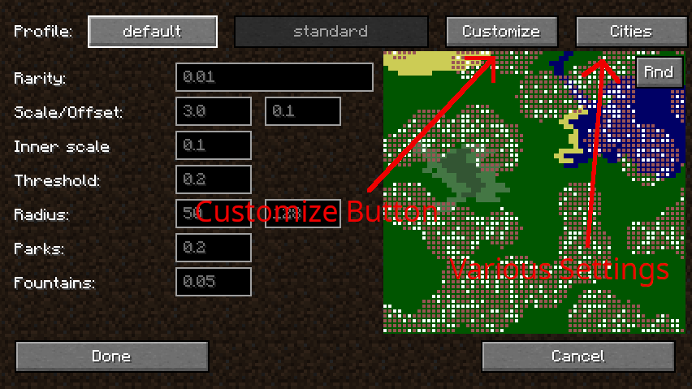
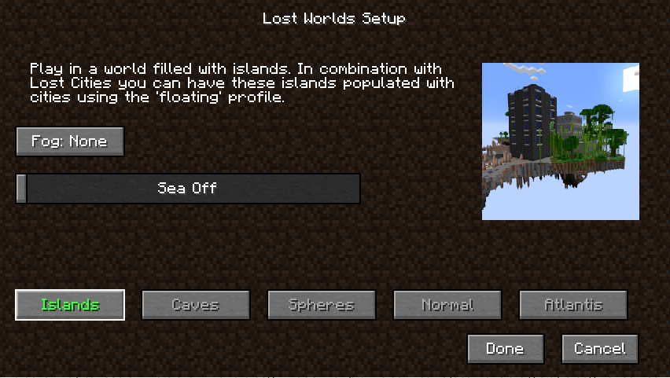

# Lost Cities and Lost Worlds

The Lost Cities is a world generation mod.
Lost Worlds is a companion mod that adds two new world
types that can be used in conjunction with Lost Cities.
In this chapter both mods are explained.

This documentation is mostly relevant for Minecraft 1.18.2 or later.
Lost Worlds is only available on Minecraft 1.20.1 or later.

You can find the documentation for older versions here:
[The Lost Cities Legacy](./lost-cities-legacy.md)

## Introduction

**Lost Cities** has two major functionalities:

* You can configure it to add cities to the overworld. It should be compatible with most world types
* It also adds a new dimension ('lostcities:lostcity') that you can travel to from within a normal overworld (or from
  another Lost City world)

Here is a gallery with screenshots:

[Gallery](https://minecraft.curseforge.com/projects/the-lost-cities/images)

**Lost Worlds** is a companion mod that adds two new world presets (Lost Worlds and Lost Worlds (Wastes)).
With these world types you can generate a few different types of worlds:

* Islands: this is a void world with floating islands. In combination with Lost Cities you can populate these islands
  with cities (use the 'floating' profile for that)
* IslandsW: this is similar but instead of a void world the islands are floating on top of an infinite ocean
* Caves: this is a world similar to the nether but with regular stone and ores. You can use this in combination with
  the 'cavern' profile for Lost Cities. Warning! This is very hard
* Spheres: this is a void world that you can use in combination with the 'space' profile for Lost Cities. This will
  generate spheres which may contain cities
* Normal: this is a normal style world that can be used in combination with the Lost Cities 'biosphere' profile. This is
  best used in combination with the 'Wastes' version of the world preset

## How to use

### Lost Cities Single Player

When creating a world go to the tab where you can do extra configuration and there you press the _Cities_ button:

Using the profile button you can choose between different profiles.
These profiles control the style of the cities that
are generated.

It is also possible to further customize the cities by pressing the _Customize_ button:

Using that button you can configure the style of the cities, the amount of cities, the distance between cities, the
height of the buildings, how much damage there is and so on.

After you have configured the world you can press the _Done_ button and continue with creating the world.

### Lost Cities Multiplayer

The easiest way to configure Lost Cities for multiplayer is to first configure it for single player and then copy the
`lostcities-server.toml` file that you can find in your created single player world (`saves/<yourworld>
/serverconfig/lostcities-server.toml`) to the server `defaultconfigs` directory BEFORE creating the world there.

:::danger Warning
It is NOT needed to copy the entire single player world to the server. Only the `lostcities-server.toml` file is needed
:::

If you want to configure the world on the server itself then you can do that by editing the `lostcities-server.toml`
file.

### Lost Worlds Single Player

While Lost Cities adds cities to whatever world type that you created it doesn't actually modify how the world itself is
generated.
The Lost Worlds mod adds two new world types that you can use to generate worlds that are more suitable for Lost Cities.

To select this world type you need to go to the _World_ options tab and then select the _Lost Worlds_ world type:

There is also a second world type called _Lost Worlds (Wastes)_.
This is similar to the _Lost Worlds_ world type, but it has a different biome distribution.
Many biomes are replaced with more wasteland-like biomes (deserts, badlands, gravelly mountains, etc).

It's also possible to customize the world type by pressing the _Customize_ button. This will open a screen where you can
configure this world type:

The five possible types are:

* Islands: this is a void world with floating islands. In combination with Lost Cities you can populate these islands
  with cities (use the 'floating' profile for that)
* IslandsW: this is similar but instead of a void world the islands are floating on top of an infinite ocean
* Caves: this is a world similar to the nether but with regular stone and ores. You can use this in combination with
  the 'cavern' profile for Lost Cities. Warning! This is very hard. It may be recommended to use a spawn chest to help
  get started
* Spheres: this is a void world that you can use in combination with the 'space' profile for Lost Cities. This will
  generate spheres which may contain cities
* Normal: this is a normal style world that can be used in combination with the Lost Cities 'biosphere' profile. This is
  best used in combination with the 'Wastes' version of the world preset

### Lost Worlds Multiplayer

## Basic Structure

This page is mostly about the internal structure and configuration about the mod.
In this first section the basic operation of the mod is explained.

The buildings, bridges, subway system, fountains and other structures you find in the world are actually not structures but real worldgen.
That means that are generated at the very first stage when a chunk is built.
This makes generation very efficient and also allows it to fit much better when the surrounding world.

It is important to note that this mod cannot depend on any specific order of chunk generation.
When generating a chunk it cannot depend on neighbouring chunks already being generated, so it has to be able to
calculate things on its own.
Nevertheless, this mod maintains several world-wide data structures and is able to query information about nearby chunks
without actually having to generate the chunk.

Read about it here: [Basic Structure](./structure.md)

## Configuration

TODO

## The Asset System

The asset system is a powerful system that you can customize to make your own buildings, decorations, control loot, mob
spawners, building blocks and more.

* For 1.17 and older you can read about it here: [Asset System](./asset.md)
* For 1.18 and newer you need to visit this: [Asset DataPack System](./asset-datapack.md)
